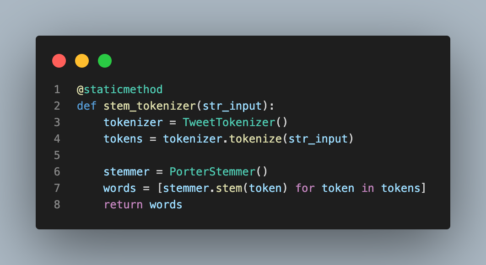
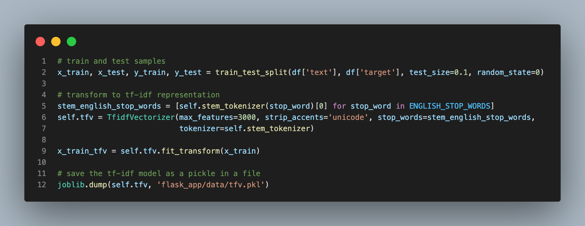
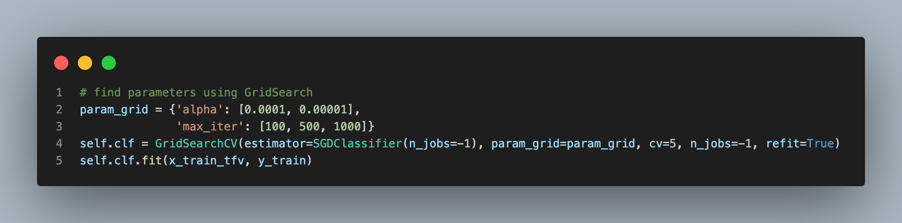
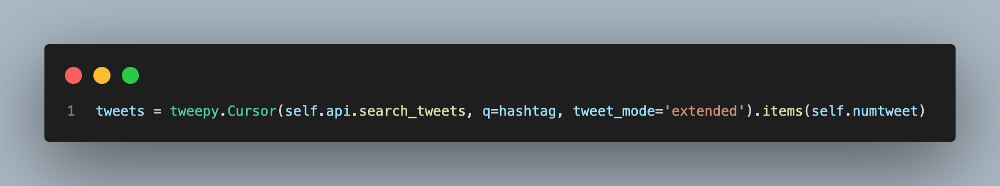

<h1>Twitter sentiment analysis API</h1>
<h2>See blog post <a href="#blog">here</a></h2>

API with Flask, Flask-RESTful and
Flask-RESTful-Swagger

A React Native application is available for this API - source code and instructions for the project can be found <a href="https://github.com/rikardv/sentimenty">here</a>.

Usage
-----

Clone the repo:

    git clone https://github.com/rikardv/twitter-sentiment-api
    cd twitter-sentiment-api

First time installation:

    pip3 install virtualenv
    virtualenv venv
    source venv/bin/activate
    pip3 install -r requirements.txt
    python3 setup.py develop # or install if you prefer

Run the sample server

    python3 runserver.py

Try the endpoints:

    curl -XGET http://localhost:5000/dummy
    curl -XPOST -H "Content-Type: application/json" http://localhost:5000/hello -d '{"name": "World"}'
    curl -XPOST -H "Content-Type: application/json" http://localhost:5000/sentiment -d '{"tag": "#ElonMuskIsATroll"}'

Swagger docs available at `http://localhost:5000/api/spec.html`
{#blog}
<h2>Blog post<h2>

<h4>Why should I care about sentiment analysis?</h4>
Sentiment analysis is important because it provides insight into how people feel about a product, service, or topic. It gives businesses and organizations the ability to measure customer satisfaction and identify trends in public opinion. Sentiment analysis can also provide valuable feedback on the effectiveness of marketing campaigns and help inform decisions about product development. 

<h4>Why sentiment analysis works great with machine learning</h4>
Sentiment analysis can be used with machine learning to provide more accurate and detailed insights. Machine learning algorithms can analyze large amounts of data to detect patterns and trends that would be difficult to detect manually. For example, machine learning can be used to detect how sentiment changes over time, identify topics that are associated with positive or negative sentiment, and detect the types of language that are used to express sentiment. This can help businesses and organizations make better decisions about how to engage with their customers.

<h4> Feature extraction and TF-IDF</h4>
Feature extraction and TF-IDF (term frequency-inverse document frequency) are two popular methods for analyzing sentiment in text. Feature extraction is a technique for extracting meaningful features from text data. These features can then be used as input for machine learning algorithms. TF-IDF is a statistic that measures how important a word is to a document in a collection or corpus. It is commonly used for information retrieval and text mining. By combining feature extraction and TF-IDF, sentiment can be accurately and efficiently analyzed from large amounts of text data.

<h4> Using countvectorizer with TF-IDF</h4>
Another popular technique for sentiment analysis is CountVectorizer. CountVectorizer is a machine learning algorithm that takes a collection of text documents as input and produces a vector of token counts. The resulting vector can be used as input to a machine learning algorithm for sentiment analysis. CountVectorizer is a popular and effective technique for sentiment analysis because it allows for efficient and accurate analysis of large amounts of text data.

<h4> How to summarize text using TextRank? </h4>
TextRank is another machine learning algorithm that can be used for summarization. TextRank is an unsupervised algorithm that uses a graph-based approach to identify important phrases and words in a text. It is based on the idea that words and phrases that appear more frequently or are related to each other in the text are more likely to be important. TextRank can be used for summarization by extracting the most important phrases and words from a text and using them to create a summary. TextRank is a powerful and effective technique for summarization and can be used to quickly and accurately generate summaries from large amounts of text data.

<h3> Moving on to the code </h3>

<h4>Using Sentiment140 to train the model</h4>

The Sentiment140 dataset was used in this project which is a dataset that contains 1.6 million tweets, each labeled with a sentiment polarity (positive, neutral, or negative). The dataset was created by researchers at Stanford University and was used to train a number of sentiment analysis models. The tweets were collected using Twitter's API and were pre-processed to remove any user-identifying information. Each tweet is represented by a set of six fields: target, ids, date, flag, user, and text. The target field contains the sentiment polarity label (0 = negative, 2 = neutral, 4 = positive), and the text field contains the text of the tweet. The ids, date, flag, and user fields contain additional information about the tweet, such as the tweet's unique identifier and the user who posted it.

<h4> Briefly about the classifier code</h4>
The following snippet is a part of the code used to generate a Machine Learning model to perform sentiment analysis on text. The code begins by retrieving a dataset containing sentiment labels and text. It then tokenize the text into words/tokens and applies a stemmer to each word in ordet to return it to its base form.

 Next, it splits the data into training and testing samples. The text is then transformed into a TF-IDF (term frequency-inverse document frequency) representation.

 

 The TF-IDF model is saved as a pickle in a file. So user results are much faster by loading the pickled model and performing the prediction directly.

Finally, parameter tuning using grid search is a powerful technique for optimizing machine learning models. Grid search uses a range of parameters to optimize the performance of the model. By testing different combinations of parameters, the best combination can be identified and the model can be tuned to achieve the desired result. Grid search is an important technique for Machine Learning models, particularly for sentiment analysis applications, and can help improve the accuracy and efficiency of the model.

The accuracy of the model is tested using the test samples. Finally, the model is saved as a pickle in a file to quickly access the model when a user is requesting it instead of generating the model each time.

#### Getting the test data using Twitter API
Tweepy works by using the Twitter API to access tweets from the platform.

The code above is using the Tweepy API to search for tweets with the given hashtag, and then it is extracting the tweet data, including the target, ids, date, flag, user, and text. It is then storing the data in the tweets variable, which can be used as input for the summarizer and classifier models described earlier.

(<a href="#readme-top">back to top</a>)

License
-------

MIT, see LICENSE file

