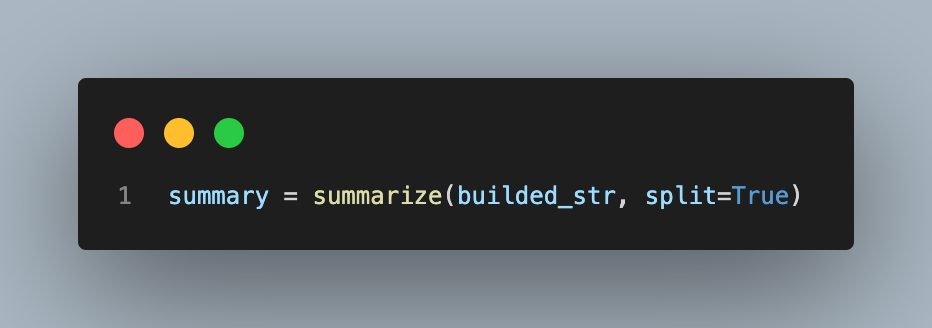
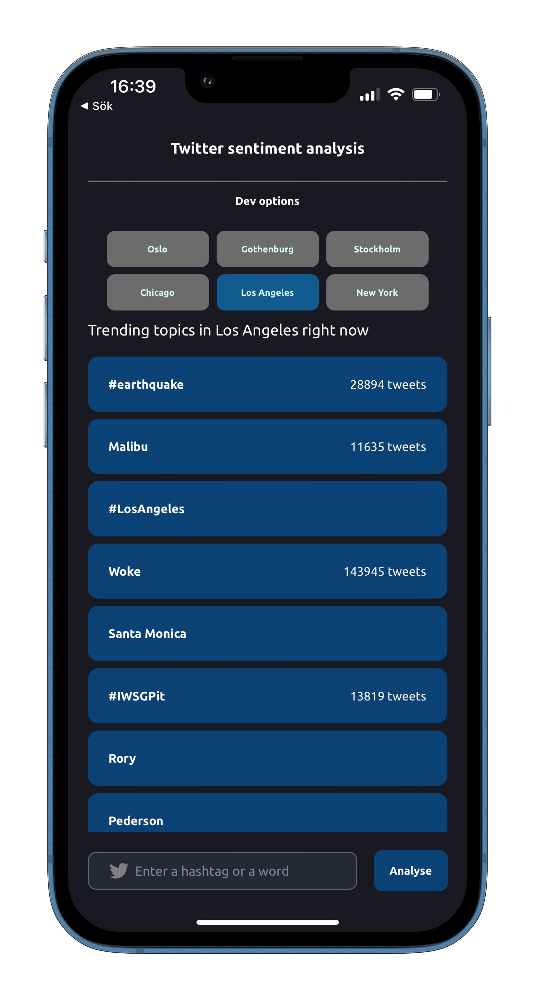
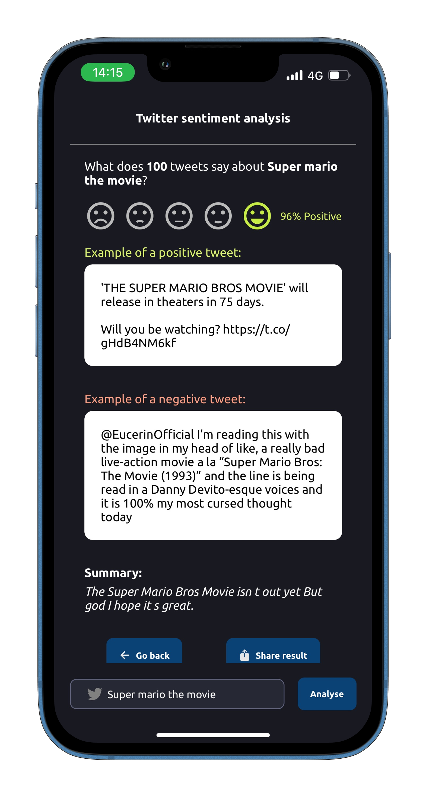

<h1>Twitter sentiment analysis API</h1>

<p>API with Flask, Flask-RESTful and
Flask-RESTful-Swagger</p>
<p>A React Native application is available for this API - source code and instructions for the project can be found <a href="https://github.com/rikardv/sentimenty">here</a>.</p>

Usage
-----

Clone the repo:

    git clone https://github.com/rikardv/twitter-sentiment-api
    cd twitter-sentiment-api

First time installation:

    pip3 install virtualenv
    virtualenv venv
    source venv/bin/activate
    pip3 install -r requirements.txt
    python3 setup.py develop # or install if you prefer

Run the sample server

    python3 runserver.py

Try the endpoints:

    curl -XGET http://localhost:5000/dummy
    curl -XPOST -H "Content-Type: application/json" http://localhost:5000/hello -d '{"name": "World"}'
    curl -XPOST -H "Content-Type: application/json" http://localhost:5000/sentiment -d '{"tag": "#ElonMuskIsATroll"}'

Swagger docs available at `http://localhost:5000/api/spec.html`
## Blog post

<h4>Why should I care about sentiment analysis?</h4>
Sentiment analysis is important because we can learn how people feel about a product, service, or subject. One aspect is that businesses and organizations have the ability to measure customer satisfaction and identify trends in order to refine marketing campaigns and help inform decisions about product development. However, in this case - the resulting product is aimed towards entertainment purposes but proves the concept of using sentiment analysis to find a public opinion of a topic.

<h4>Sentiment analysis works great with machine learning</h4>
Sentiment analysis can be used with machine learning to provide more accurate and detailed insights. Machine learning algorithms have the ability of analyzing large amounts of data to detect patterns and trends that humans would a problems to detect. For example, machine learning can be used to detect how sentiment changes over time, identify topics that are associated with positive or negative sentiment, and detect the types of language that are used to express sentiment. This can help businesses and organizations make better decisions about how to engage with their customers.

<h4> Feature extraction and TF-IDF</h4>
Feature extraction and TF-IDF (term frequency-inverse document frequency) are two popular methods for analyzing sentiment in text. Feature extraction is a technique for extracting meaningful features from text data and these features can then be used as input for machine learning algorithms. TF-IDF is a statistic that measures how important a word is to a collection of documents and it's commonly used for information retrieval and text mining. By combining feature extraction and TF-IDF, sentiment can be accurately and efficiently analyzed from large amounts of text data or in this case: tweets.

<h4> TfidfVectorizer in python</h4>
As mentioned before, The TF-IDF weight is a measure of the importance of a word in a particular document compared to the entire corpus unlike using only term-frequency approaches where the terms are isolated. The formula is as follows,

$$tf-idf(t,d) = tf(t,d) \times idf(t)$$

where ```tf(t,d)``` is defined as the number of times the term ```t``` appears in document ```d``` and

$$idf(t) = log \left( \frac{|Z|}{1 + |\{d: t \in d\}|} \right)$$

Thankfully Python has a module called ```TfidfTransformer``` provided by Scikit.learn that computes this matrix and is the module that this API uses. 


<h4> Now that we have a sentiment under control - we can also summarize text using TextRank </h4>
TextRank is another machine learning algorithm that can be used for summarization and  is an unsupervised algorithm that uses a graph-based approach to identify important phrases and words in a text. It is based on the idea that words and phrases that appear more frequently or are related to each other in the text are more likely to be important. It can be used for summarization by extracting the most important phrases and words from a text (or more specific here, a collection of tweets) and using them to create a summary. TextRank is a powerful and effective technique that will be used in the API for summarizing the tweets since it accurately generate summaries from large amounts of data.

<h3> Enough theory. Let's move on to the code </h3>

<h4>Using Sentiment140 to train the model</h4>

The Sentiment140 dataset was used in this project which is a dataset that contains 1.6 million tweets, each labeled with a sentiment polarity corresponding to positive, neutral, or negative. The dataset was created by researchers at Stanford University and has been used in many projects to train sentiment analysis models. The tweets were collected using Twitter's API and were pre-processed to remove any user-identifying information. Important to know about the dataset is that each tweet is represented by a set of six fields: target, ids, date, flag, user, and text. The target field contains the sentiment polarity label (0 = negative, 2 = neutral, 4 = positive), and the text field contains the text of the tweet. The ids, date, flag, and user fields contain additional information about the tweet, such as the tweet's unique identifier and the user who posted it.

<h4> Briefly about the classifier code</h4>
The following snippet is a part of the code used to generate a process the tweets before performing the sentiment analysis training. The code begins by retrieving a dataset containing sentiment labels and text. It then tokenize the text into words/tokens and applies a stemmer to each word in order to return it to it's base form.


 Next, it splits the data into training and testing samples. The text is then transformed into a TF-IDF (term frequency-inverse document frequency) representation.

 

The TF-IDF model is saved as a pickle in a file. So user results are much faster by loading the pickled model later on and performing the prediction directly when it is requested.

Finally, parameter tuning using grid search is a powerful technique for optimizing machine learning models. Grid search uses a range of parameters to optimize the performance of the model. By testing different combinations of parameters, the best combination can be identified and the model can be tuned to achieve the desired result. Grid search is an important technique for Machine Learning models, particularly for sentiment analysis applications, and can help improve the accuracy and efficiency of the model. Here we use Support Vector Machine (SVM) which is widely regarded as one of the best text classification algorithms.

The accuracy of the model is tested using the test samples.

We then log out how well the SVM model perfoms and see the optimal parameters
```
SVM accuracy: 0.7651708333333335
alpha: 1e-05
max_iter: 1000
```

We have a pretty good accuracy of the model with the optimal parameters, awesome!


#### Getting the test data using Twitter API
Tweepy works by using the Twitter API to access tweets from the platform.


The code above is using the Tweepy API to search for tweets with the given hashtag, and then it is extracting the tweet data, including the target, ids, date, flag, user, and text. It is then storing the data in the tweets variable, which can be used as input for the summarizer and classifier models described earlier.

<em>Side note - we are also taking advantage of tweepy to collect trending topics to provide as a nice feature</em>


#### Summarize the text

As mentioned before, TextRank is a powerful tool for summarizing text and we can use ```summa.summarizer```in python with a single line of code.



The only problem here is that we're not dealing with a document of text, but rather a collection of tweets. Therefore an algorithm was also developed to concentate the tweets into senctences which are put together as a full text and then passed to the summarizer.

### Let's connect it to a friendly interface

The result would be boring to look at without a user-friendly interface. We handle most of the logic in the API so creating an app is fairly straightforward.

#### Displaying the trending topics using a few cities 

The API accepts an ``woeid`` (Where On Earth Identifier) as parameter and returns trending topics that corrosponds to that id. Let's display them as a landing page for the user and let them toggle between cities.



The user can then decide to search for their own hashtag or word to send as parameter or select one of the available.

Using this query we make a request to the API which returns a few rows for sentiment along with a summary in the following format.


```
SentimentResult {
    "entered_hashtag": string,
    "negative_tweets": number,
    "positive_tweets": number,
    "random_negative_tweet": string,
    "random_positive_tweet": string,
    "sentiment": string,
    "summary": string,
    "tweets_analysed": number
}
```

We display returned object in a nice layout as seen below - it seems that people really like the new Super mario movie!





Source code for the React Native application can be found <a href="https://github.com/rikardv/sentimenty">here</a>.

Thank you for reading!


License
-------

MIT, see LICENSE file

